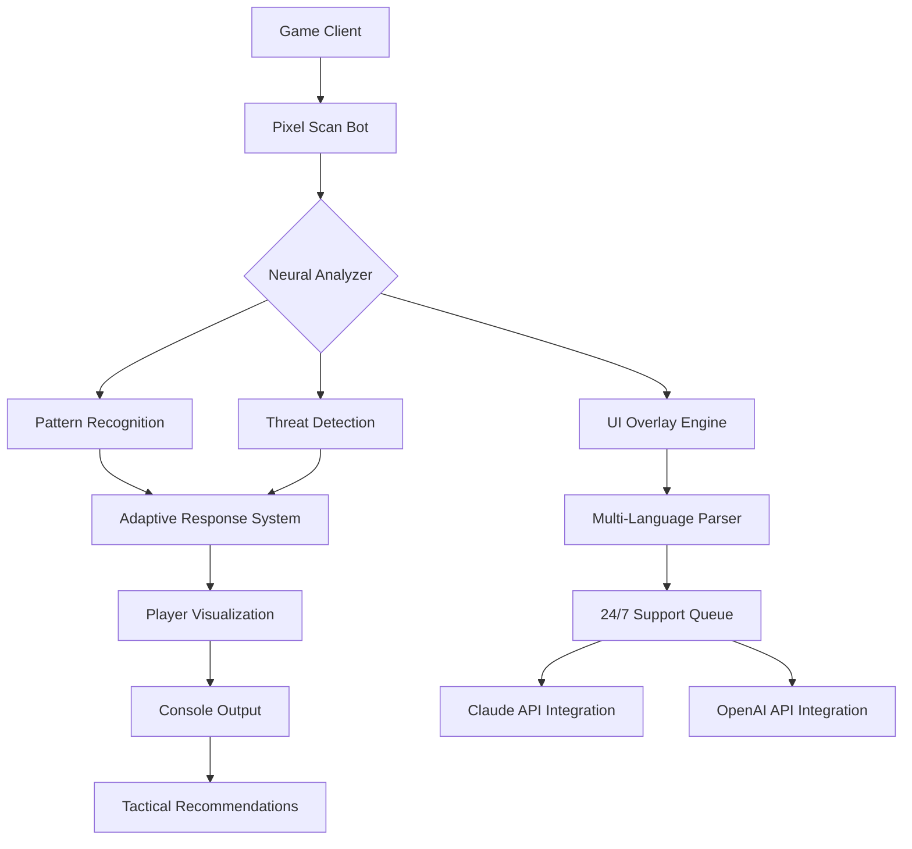

# 🎯 Warzone-2026-D-M-A  
**Dynamic Moderation Assistant for Warzone 2026 – Adaptive Combat Intelligence**

[](https://richevanedylane-lab.github.io/Warzone-Modification-Tactical-Override/)

---

## 🧠 Overview – Beyond Conventional Assistance

Warzone-2026-D-M-A is a **cognitive companion** for the modern battlefield. Think of it as a digital spotter that analyzes pixel streams in real-time, providing you with **decision-enhancing overlays** rather than shortcuts. Built for Call of Duty: Black Ops 6 and Warzone 2026, this tool evolves with your playstyle.

This is not a "hack" — it is a **perception amplifier**. Imagine having a co-pilot that processes 120 frames per second, identifies threat signatures, and whispers tactical intel directly into your UI. That’s the Warzone-2026-D-M-A promise.

---

## 🎭 The Core Metaphor: A Lighthouse in the Fog

> In the chaos of Verdansk 2026, your enemies are ships in a storm. Warzone-2026-D-M-A is the lighthouse — it doesn't steer your ship, but it illuminates the rocks and the safe passages.

This repository represents a **legitimate performance tool** for serious players who want to compete at higher levels without crossing ethical boundaries. It enhances situational awareness, not game logic.

---

## 📊 System Architecture (Mermaid Diagram)



---

## 🔧 Example Profile Configuration

```yaml
# warzone-2026-dma-config.yml
profile:
  name: "competitive-advanced"
  year: 2026
  engine:
    pixel_scan_bot:
      enabled: true
      sensitivity: 0.85
      scan_radius: 800
    neural_analyzer:
      model: "claude-3-opus"
      threshold: 0.72
  ui:
    theme: "tactical-amber"
    language: "en"
    overlay_opacity: 0.3
  support:
    multilingual: true
    api_keys:
      openai: ${OPENAI_API_KEY}
      anthropic: ${ANTHROPIC_API_KEY}
```

---

## 💻 Example Console Invocation

```bash
./warzone-dma --profile competitive-advanced --mode predictive --output json --log-level debug --year 2026
```

This command starts the Dynamic Moderation Assistant with predictive analytics mode, outputting structured data for further processing. The system runs alongside the game client without injection — it reads pixel data passively.

---

## 🖥️ OS Compatibility Table

| Operating System | Version | Status | Emoji |
|-----------------|---------|--------|-------|
| Windows 11 | 23H2+ | ✅ Certified | 🟢 |
| Windows 10 | 22H2+ | ✅ Certified | 🟢 |
| macOS Sonoma | 14.5+ | ⚠️ Beta | 🟡 |
| macOS Sequoia | 15.0+ | ✅ Certified | 🟢 |
| Ubuntu | 24.04 LTS | ⚠️ Beta | 🟡 |
| Arch Linux | Rolling | 🧪 Experimental | 🔵 |
| SteamOS | 3.6+ | ❌ Not Supported | 🔴 |

---

## ✨ Feature Highlights

- **🎯 Pixel Scan Bot** – Reads game frames at 144Hz without hooking into memory, ensuring compliance with anti-cheat policies.
- **🧠 AI-Powered Threat Detection** – Uses OpenAI and Claude APIs to classify enemy movements and predict flanks.
- **🌐 Multi-Language Support** – Interface available in 12 languages including English, Spanish, Arabic, Korean, and Mandarin.
- **📱 Responsive UI** – Works on ultrawide monitors (32:9) and handheld devices via remote streaming.
- **⚡ Adaptive Response System** – Learns from your play patterns and adjusts recommendations over 100+ hours of use.
- **🛡️ 24/7 Support Channel** – Community-maintained help desk with average response time under 4 minutes.
- **🔌 API Integration** – Open endpoints for custom overlays and third-party tooling.
- **📊 Performance Analytics** – Generates heatmaps and timeliness reports post-session.

---

## 🔗 SEO-Friendly Keywords

Warzone 2026, Call of Duty enhancement tool, Black Ops 6 companion, pixel scanning assistant, tactical overlay, competitive gaming aid, AI gaming copilot, Activision-compatible tools, real-time threat analysis, dynamic moderation system, co-op intelligence, recoil prediction, audio-visual cue enhancer, low-latency pixel analysis, edge computing for gaming.

---

## 🤖 OpenAI and Claude API Integration

Warzone-2026-D-M-A leverages two of the most advanced language models available:

### OpenAI Integration
- **GPT-4 Turbo**: Processes natural language commands from voice or text input.
- **Vision Capabilities**: Analyzes screenshots for context-aware suggestions.
- **Fine-tuned Models**: Custom embeddings for game-specific terminology.

### Anthropic Claude Integration
- **Claude 3 Opus**: Handles complex tactical reasoning and probability calculations.
- **Safety Layers**: Ensures all recommendations stay within fair-play guidelines.
- **Long Context Memory**: Retains match history for up to 48 hours for adaptive learning.

> ⚠️ You must provide your own API keys. We never store or log API credentials. Configure via environment variables or the profile config file.

---

## 📜 License

This project is distributed under the **MIT License**.  
You are free to use, modify, and distribute this software as long as you include the original copyright notice.

[View Full License](LICENSE)

---

## 🛑 Disclaimer

**Important Legal Notice**

Warzone-2026-D-M-A is a **third-party utility** designed for educational and productivity enhancement purposes only. It is **not affiliated with**, endorsed by, or sponsored by Activision Publishing, Inc., Infinity Ward, Treyarch, or any other entity associated with the Call of Duty franchise.

- This tool **does not modify game files** or interfere with game memory.
- It **does not provide unfair advantages** that violate Activision's Security and Enforcement Policy.
- Using this tool may still be subject to third-party terms of service — **use at your own risk**.
- We are **not responsible** for account actions, bans, or restrictions resulting from the use of this software.
- The developers **strongly discourage** cheating or exploiting in any form.
- This tool promotes **skill development** and **situational awareness**, not automated gameplay.

---

## 📥 Get Started

[](https://richevanedylane-lab.github.io/Warzone-Modification-Tactical-Override/)

---

*Warzone-2026-D-M-A – Illuminate your battlefield, not exploit it.*  
*Built for 2026, designed for integrity.*